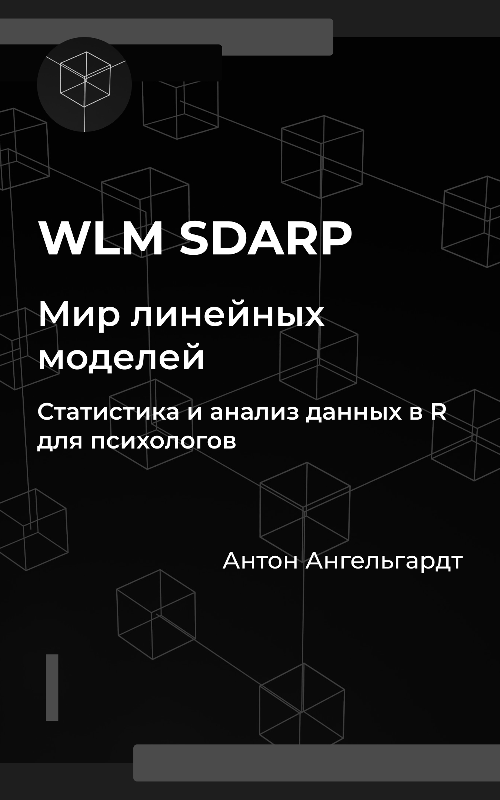

::::{.columns}

:::{.column width=20%}

:::

:::{.column width=10%}
:::

:::{.column width=70%}
### WLM SDARP I

**Мир линейных моделей: статистика и анализ данных в R для психологов**

Про статистику, чтоб исследования делать нормально.

[Читать]()

:::
::::
