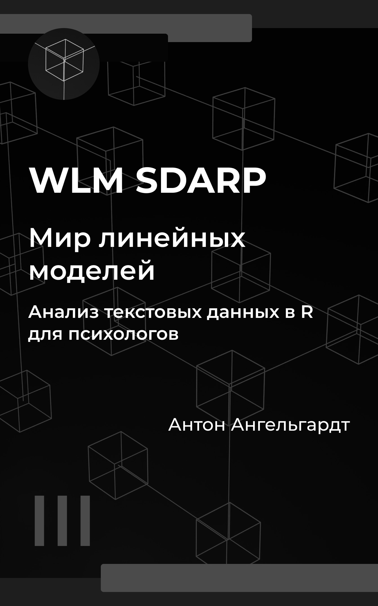

::::{.columns}

:::{.column width=20%}

:::

:::{.column width=10%}
:::

:::{.column width=70%}
### WLM SDARP III

**Мир линейных моделей: анализ текстовых данных в R для психологов**

Ищем смыслы в текстах автоматически.

[Читать]()

:::
::::
